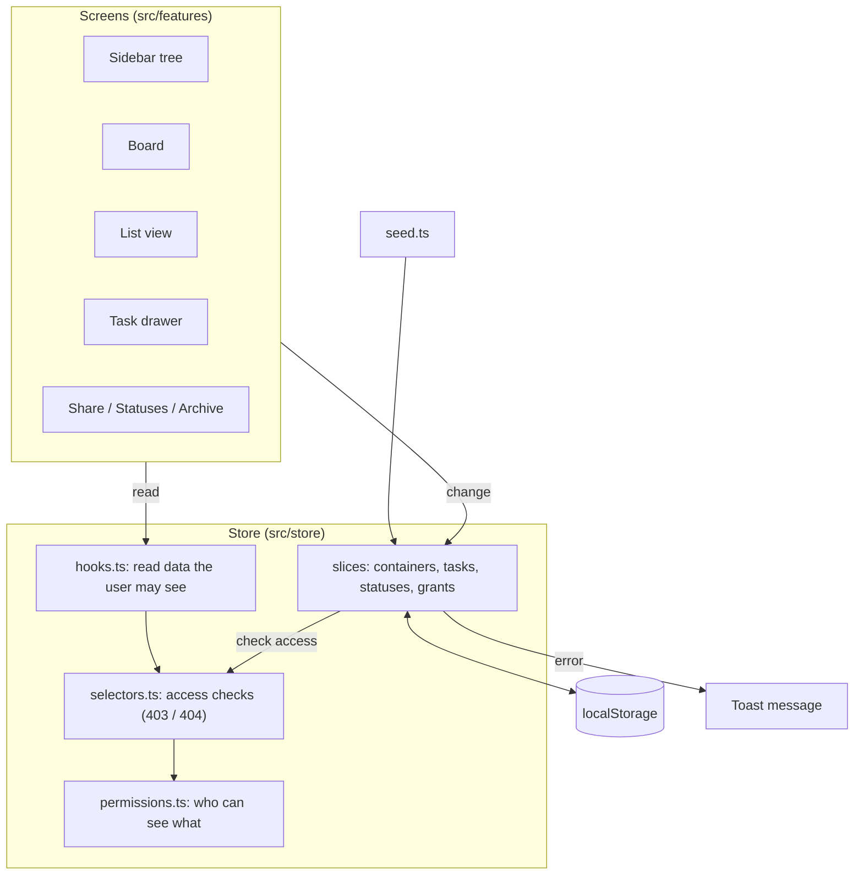

# Flowboard

Flowboard is a small project-management app, like a mini Trello or ClickUp, for one team.

You can:

- organise work in a tree: **space → folder → list**
- add tasks to lists and edit them
- see tasks on a **kanban board** or in a **table**
- control **who can see what** with a simple permission system

There is no backend. All data lives in the browser.

### How work is organised

```
Flowboard HQ            ← the workspace (the whole company)
└── Engineering         ← a space (a department)
    └── Q2 Launch       ← a folder (a project)
        ├── Backlog     ← a list (holds tasks)
        └── Sprint 14   ← another list
```

Only lists hold tasks.

## Run it locally

You need Node.js 20.19+ or 22.12+.

```bash
npm install
npm run dev
```

Then open http://localhost:5173.

Other commands:

| Command | What it does |
|---|---|
| `npm test` | Runs the tests |
| `npm run build` | Checks types and builds for production |
| `npm run preview` | Serves the production build |

To start fresh, click the workspace name (top left) → **Reset demo data**.

## Quick tour

1. **Sidebar:** the workspace tree. Click a list to open it. Admins can hover a row to add, rename, share, archive or drag it.
2. **Board / List switch:** shows the open list as kanban columns or as a table.
3. **Drag cards** between columns to change status, or up and down to reorder.
4. **Click a task** to open the side panel and edit it.
5. **User menu** (top right): switch between the three demo users and see how access changes.
6. **Workspace menu** (top left): open the **Archive** (admins only) or reset the demo data.

## Demo users

| User | Role | What they see |
|---|---|---|
| Aarav Sharma | Admin | Everything |
| Rohan Mehta | Member | Only the **Backlog** list |
| Priya Nair | Member | **Sprint 14** and **Marketing**, but not Backlog |

Try this: open Sprint 14 as Aarav, then switch to Rohan. The list disappears from his sidebar, and the page shows "No access".

## Tech stack

| Tool | Why |
|---|---|
| React 19 + TypeScript | Required by the brief. TypeScript runs in strict mode, with no `any`. |
| Vite | Fast dev server and simple setup |
| Tailwind CSS 3 | All styling. Version 3 keeps theme settings in `tailwind.config.ts`; version 4 would need a CSS file, which the brief doesn't allow. |
| Zustand | Simple, typed store for all data and actions |
| dnd-kit | Drag and drop that also works with the keyboard and screen readers |
| Headless UI | Accessible menus, dialogs and the side panel, styled with Tailwind |
| Vitest + Testing Library | Tests |

## How the code is organised

```
src/
├── types.ts       data shapes
├── data/seed.ts   demo data
├── store/         all data, rules and permission checks
├── ui/            small reusable pieces (Button, Avatar, Select…)
├── features/      the screens (sidebar, board, list, drawer…)
├── hooks/         shared hooks (keyboard shortcuts, fake loading)
└── lib/           small helpers (dates, ids)
```

### Architecture



**The main rule:** screens never read raw data or change it directly.

- **Reading:** screens use hooks that hand back only what the current user is allowed to see.
- **Changing:** screens call a store action. The action checks permissions and rules, then either saves the change or returns an error. Errors appear as a toast.

## Data model

All types are in `src/types.ts`.

```ts
Container { id, name, type, parentId, position, visibility, archivedAt }
Task      { id, number, title, description, statusId, priority, assigneeIds, dueDate, position, primaryListId, createdAt, updatedAt }
Status    { id, listId, name, category, color, position }
User      { id, name, role, tone }
Grant     { id, resourceId, userId, mode }
```

- **Container:** one shape for workspace, space, folder and list. The `type` field says which.
  - Allowed nesting: workspace → space → folder → list. Only lists hold tasks.
- **position:** keeps things in order (tree items, columns, cards).
- **Status:** each list has its own statuses, which are the board's columns.
  - Every status has a fixed **category**: `todo`, `in_progress` or `done`. This tells the app which tasks are finished.
  - Categories also let a task keep a sensible status when it moves to another list.
  - Every list must keep at least one status in each category.
- **Task:**
  - `number` gives short IDs like `FB-12`.
  - `statusId` must be one of its list's statuses.
- **Grant:** an access exception for one user on one container: `allow` or `deny`.

### Archive and delete

- **Archive** hides an item and everything inside it. Nothing is lost.
- **Restore** brings it back from the Archive (workspace menu).
- **Delete** is only offered for archived items. It removes the item, everything inside it, and their tasks. This two-step flow prevents accidents.

### Saving data

- The domain data is saved in `localStorage` under the key `flowboard:data`.
- Your last list and view are saved under `flowboard:ui`.
- When the demo data changes shape, the saved version number goes up. Old saved data is then replaced with the new demo data.

## How permissions work

**Who can do what**

| Action | Admin | Member |
|---|---|---|
| See spaces, folders, lists | All | Only allowed ones (rules below) |
| Add, rename, reorder, archive, delete | ✓ | — |
| Share (change access) | ✓ | — |
| Manage statuses | ✓ | — |
| Create, edit, move, delete tasks | ✓ | Only in lists they can see |

**Visibility rules for members**, checked from the top of the tree down:

1. If you can't see a parent, you can't see anything inside it.
2. A **deny** grant hides the item. An **allow** grant shows it.
3. With no grant, **public** items are visible and **private** items are hidden.
4. Archived items are hidden from everyone.

Admins change these settings with **Share** (item menu → Share…, or the Share button on a list).

**Checks happen in the store, not just the screen.**

- Every store action checks permissions before it changes anything.
- A blocked action returns a clear error:
  - `{ error: { code: 'FORBIDDEN', ... } }` for no access (like a 403)
  - `NOT_FOUND` for archived or deleted items (like a 404)
  - `INVALID` for broken rules, such as an empty name
- The screen also hides buttons you can't use. That's just for convenience: calling an action directly as Rohan still fails.
- Switching users updates the whole app instantly.

### How this could grow

- **Teams:** let a grant target a team as well as a user.
- **Read-only access:** add a `view` or `edit` level to grants.
- **A real backend:** the permission functions are plain TypeScript with no browser code, so they could move to a server unchanged.

## Tests

Run with `npm test`. There are 9 tests in 3 files:

| File | What it checks |
|---|---|
| `src/store/permissions.test.ts` | Each user sees exactly the right lists; a hidden parent hides its children; archived items are hidden |
| `src/store/store.test.ts` | Members can't change tasks in lists they can't see; only admins can change the structure; archived lists return "not found" |
| `src/features/list/ListView.test.tsx` | Sorting by due date works (tasks with no date go last); clicking a row opens the task |

## Extras (stretch goals)

1. **Search:** the box at the top filters the open list's tasks by title and description.
2. **Keyboard shortcuts:**

   | Key | Action |
   |---|---|
   | `/` | Search |
   | `n` | New task |
   | `b` | Board view |
   | `l` | List view |
   | `?` | Show all shortcuts |

Also: when you drag a card, the board updates right away. If the store rejects the move, the card snaps back.

## Inline `style=` exceptions

All styling is Tailwind. The only inline styles are the moving positions during a drag, which change every frame. They're set by dnd-kit:

- `src/features/board/Column.tsx`: task cards
- `src/features/sidebar/Tree.tsx`: sidebar rows
- `src/features/statuses/StatusManager.tsx`: status rows

## Trade-offs

What I kept simple or left out, and why:

- **Fake loading:** a short 350 ms delay shows the loading skeletons. A real app would show them while waiting for the server.
- **No search debounce:** search filters a few tasks in memory, so it's instant. A delay would only make it feel slower.
- **No pagination:** it's optional in the brief, and no list has more than 7 tasks. Boards shouldn't paginate anyway, because drag-and-drop needs every card. Large lists would use paging or virtual scrolling.
- **No subtasks:** optional in the brief; left for later.
- **No user management:** the brief asks for fixed demo users. Admins control access with grants instead.
- **Tests are minimal:** they cover the required areas. The store's status rules, grants and drag logic have no tests yet.

## What I'd do in week 2

1. More tests: status rules, grants, restore and delete, plus one end-to-end test of the Aarav vs Rohan demo.
2. Subtasks.
3. Better touch support for drag and drop.
4. Bulk edit, and paging for long lists.

## AI usage log

**Tool:** Claude Opus is used as a pair programmer to set up the initial skeleton and handle code that didn’t need much of my own judgment.

**How I worked:** Broke the project down into small pieces (check the commit history) and spent a lot of time digging into the why and what behind each decision to actually understand the choices I was making.

**Where it helped**

- Setting up the project and organising the store and permission checks
- Drag and drop on the tree, board and status list, including keyboard support
- Testing changes in a real browser: drag paths, sorting, each user's access, phone sizes
- Explaining choices when I asked, e.g. why statuses have categories
- Writing testcases 

**Where I corrected it**

| What happened | What I said | Result |
|---|---|---|
| First design used a serif font, mono labels, a cream background and a lime accent | "Product will be used by professionals so typography should be professional." | Rebuilt with one clean font, neutral greys and one blue accent |
| It installed every library up front | Asked if all were needed | Removed unused ones; later I asked for the full setup in the first commit |
| Long commit messages | "Very short what, very short why" | Two-line messages |
| No phone layout | Asked about responsiveness | Slide-in sidebar and full mobile fixes |
| Statuses were fixed | Asked how to add "Backlog" or "In review" | Status manager for admins |
| Archive only, no delete | Asked for delete | Delete from the archive, with confirmation |
| No way to give access | Asked who grants access | Share dialog; I agreed to skip full user management |

